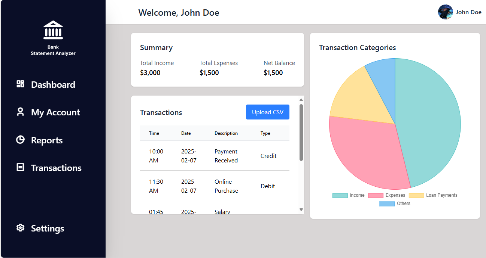

# Bank Statement Analyzer

## 📌 Overview
Bank Statement Analyzer is a web-based application that allows users to upload and analyze transaction data. The dashboard displays transaction summaries, charts, and a detailed transaction table with filtering options.

## 🚀 Features
- **Dark Mode Toggle**: Switch between dark and light mode.
- **Transaction Table**: Displays a list of transactions with filtering and sorting.
- **Summary Section**: Provides aggregated financial metrics like income, expenses, and net balance.
- **Chart Visualization**: Shows financial trends using an animated pie chart.
- **File Upload**: Supports CSV uploads with validation.
- **Mock API Integration**: Fetches data from simulated RESTful endpoints.
- **Error Handling**: Displays loading states and error messages when API calls fail.

## 📂 Project Structure
```
📂 bank-statement-analyzer
 ├── 📂 public
 │    ├── 📂 api
 │    │    ├── transactions.json  # Mock Transactions API
 │    │    ├── summary.json  # Mock Summary API
 ├── 📂 src
 │    ├── 📂 components
 │    │    ├── Header.jsx  # Sidebar Navigation
 │    │    ├── Nav.jsx  # Top Navigation with User Profile 
 │    │    ├── SummarySection.jsx  # Financial Summary
 │    │    ├── PieChartComponent.jsx  # Chart Visualization
 │    │    ├── TransactionTable.jsx  # Transactions Table with File Upload
 │    ├── App.jsx  # Main Application
 │    ├── index.js  # Entry Point
 ├── tailwind.config.js  # Tailwind CSS Configuration
 ├── package.json  # Dependencies & Scripts
 ├── README.md  # Documentation
```

## 🔧 Setup Instructions

### 1️⃣ Clone the Repository
```sh
git clone https://github.com/your-repo/bank-statement-analyzer.git
cd bank-statement-analyzer
```

### 2️⃣ Install Dependencies
```sh
npm install
```

### 3️⃣ Start the Development Server
```sh
npm run dev
```

### 4️⃣ Start Mock API (Optional, if using `json-server`)
```sh
npm install -g json-server
json-server --watch db.json --port 5000
```

## 📊 API Integration
### **Mock Endpoints**
| Endpoint                 | Description |
|--------------------------|-------------|
| `GET /api/transactions`  | Returns a list of transactions |
| `GET /api/summary`       | Returns aggregated financial summary |

### **Fetching Data in Components**
Example fetch call in `TransactionTable.jsx`:
```js
useEffect(() => {
  fetch("/api/transaction.json") // Or "http://localhost:5000/transaction"
    .then(response => response.json())
    .then(data => setTransactions(data))
    .catch(error => console.error("Error fetching transactions:", error));
}, []);
```

## 🛠️ File Upload & Validation
- **Allowed Format**: Only `.csv` files are accepted.
- **Validation**:
```js
const handleFileUpload = (event) => {
  const file = event.target.files[0];
  if (file && file.type !== "text/csv") {
    alert("Please upload a valid CSV file.");
    return;
  }
  console.log("Valid CSV uploaded:", file.name);
};
```

## 💡 Future Enhancements
- ✅ User Authentication
- ✅ Data Filtering & Export
- ✅ Advanced Chart Analytics

## Screenshot of the Work



---
✨ Built with **React, Tailwind CSS, Chart.js, and JSON Server** ✨

